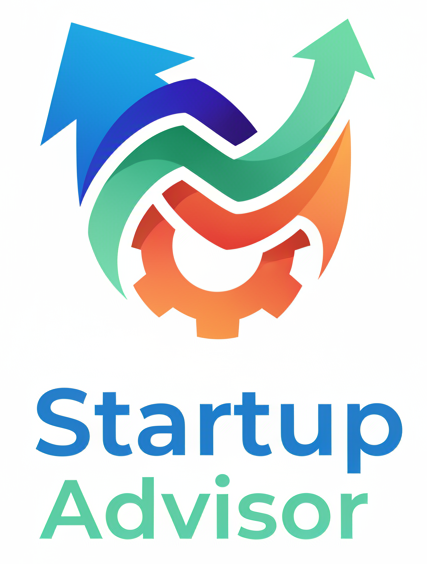

<p align="center">
  
</p>

# Startup Advisor - Multi-Agent Business Planning System

A sophisticated multi-agent system that uses Qwen3-Max to generate comprehensive business plans through collaborative AI advisors.

## Features

- **Multi-Agent Collaboration**: Three specialized AI advisors (Strategic, Financial, Operations) work together
- **Dual Output Formats**: Generate both JSON and HTML formatted business plans
- **Professional HTML Reports**: Beautiful, print-ready HTML business plans with styling
- **Structured JSON Data**: Machine-readable JSON format for further processing
- **Flexible Output Options**: Choose JSON, HTML, or both formats

## Installation

```bash
# Install required packages
pip install requirements.txt

# Create a .env file in root directory, set your QWEN api key
QWEN_API_KEY = "Your API Key"
```

## Usage

### Basic Usage (Generate Both Formats)

```bash
python startup_advisor.py --business_idea "AI-powered fitness app"
```

This will generate:
- `business_plan.json` - Structured JSON data
- `business_plan.html` - Professional HTML report

### Generate Only HTML

```bash
python startup_advisor.py --business_idea "Sustainable fashion marketplace" --format html
```

### Generate Only JSON

```bash
python startup_advisor.py --business_idea "Food delivery service" --format json
```

### Custom Output Files

```bash
python startup_advisor.py \
  --business_idea "EdTech platform for coding" \
  --json_output my_plan.json \
  --html_output my_plan.html
```

### Specify JSON Output Only

```bash
python startup_advisor.py \
  --business_idea "Smart home automation" \
  --format json \
  --json_output automation_plan.json
```

## Command Line Arguments

| Argument | Type | Default | Description |
|----------|------|---------|-------------|
| `--business_idea` | string | **required** | Brief description of your business idea |
| `--format` | choice | `both` | Output format: `json`, `html`, or `both` |
| `--json_output` | string | `business_plan.json` | Output file for JSON format |
| `--html_output` | string | `business_plan.html` | Output file for HTML format |

## Output Formats

### JSON Format

The JSON output includes:
- Executive Summary
- Strategic Plan (market analysis, competitive positioning, growth strategy)
- Financial Plan (funding requirements, revenue projections, metrics)
- Operational Plan (resources, processes, timeline, risk mitigation)
- Full plan text
- Generation timestamp

Example structure:
```json
{
  "business_idea": "AI-powered fitness app",
  "executive_summary": "...",
  "strategic_plan": {
    "market_analysis": "...",
    "competitive_positioning": "...",
    "growth_strategy": "..."
  },
  "financial_plan": {
    "funding_requirements": "...",
    "revenue_projections": "..."
  },
  "operational_plan": {
    "resource_requirements": "...",
    "timeline": "..."
  },
  "generated_at": "2024-01-15T10:30:00"
}
```

### HTML Format

The HTML output includes:
- Professional styling with modern design
- Color-coded sections for easy navigation
- Responsive layout (works on mobile, tablet, desktop)
- Print-friendly formatting
- Tables for financial data and timelines
- Icons and visual elements
- Metadata footer

The HTML is production-ready and suitable for:
- Investor presentations
- Internal documentation
- Stakeholder reports
- Printing or PDF conversion

## Viewing the Results

### View HTML in Browser

**macOS:**
```bash
open business_plan.html
```

**Linux:**
```bash
xdg-open business_plan.html
```

**Windows:**
```bash
start business_plan.html
```

### View JSON

```bash
cat business_plan.json
# Or use jq for pretty printing
cat business_plan.json | jq .
```

## Examples

### E-commerce Startup

```bash
python startup_advisor.py \
  --business_idea "Sustainable fashion marketplace connecting eco-conscious consumers with ethical brands" \
  --html_output ecommerce_plan.html
```

### SaaS Product

```bash
python startup_advisor.py \
  --business_idea "Project management tool for remote teams with AI-powered insights" \
  --format both \
  --json_output saas_plan.json \
  --html_output saas_plan.html
```

### Mobile App

```bash
python startup_advisor.py \
  --business_idea "Mental health app with personalized meditation and therapy matching" \
  --format html
```

## Architecture

### Multi-Agent System

The system uses three specialized AI advisors:

1. **Strategic Advisor**
   - Market analysis
   - Competitive positioning
   - Growth strategy
   - Long-term planning

2. **Financial Advisor**
   - Funding requirements
   - Revenue projections
   - Financial metrics
   - Cash flow planning

3. **Operations Advisor**
   - Resource allocation
   - Process optimization
   - Implementation timeline
   - Risk mitigation

### Conversation Flow

1. **Initial Analysis**: Each advisor assesses the business idea
2. **Strategic Planning**: Market and competitive analysis
3. **Financial Planning**: Revenue models and projections
4. **Operational Planning**: Resources and implementation
5. **Integration**: Combine insights and identify gaps
6. **Finalization**: Create executive summary and final plan

## API Configuration

The system uses Qwen3-Max API with the following configuration:
- Model: `qwen3-max`
- Max tokens: 8192
- Temperature: 0.7
- Top P: 0.95

## Error Handling

The system includes comprehensive error handling:
- API key validation
- Network error handling
- Response parsing with fallbacks
- Detailed error messages and troubleshooting tips

## Requirements

- Python 3.7+
- `requests` library
- Valid Qwen API key
- Internet connection

## Troubleshooting

### API Key Issues

```bash
# Check if API key is set
echo $QWEN_API_KEY

# Set API key (Linux/macOS)
export QWEN_API_KEY='your-key-here'

# Set API key (Windows)
set QWEN_API_KEY=your-key-here
```

### Connection Issues

- Check your internet connection
- Verify Qwen API service status
- Check firewall settings

### Output Issues

- Ensure you have write permissions in the output directory
- Check available disk space
- Verify file paths are valid

## License

MIT License

## Contributing

Contributions are welcome! Please feel free to submit a Pull Request.

## Support

For issues and questions:
1. Check the troubleshooting section
2. Review the examples
3. Open an issue on GitHub

## Changelog

### Version 2.0
- Added HTML output format
- Professional styling for HTML reports
- Dual format support (JSON + HTML)
- Improved command-line interface
- Enhanced error handling
- Better documentation

### Version 1.0
- Initial release
- JSON output format
- Multi-agent conversation system
- Qwen3-Max integration


